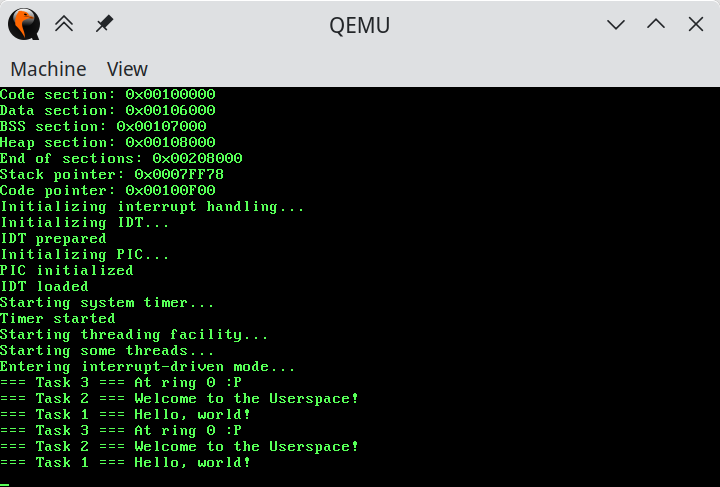

# The Purple Horse
*Why horse? Why purple? Don’t even ask.*

A sample program to demonstrate how an OS kernel works internally.

Currently supports:

 * Text output on a VGA console
 * Text output to a serial port (needs to be enabled in the source)
 * Keyboard input: press `Esc` to stop it (other keys are noticed but don’t do anything particularly interesting)
 * Multitasking! It runs several threads concurrently and switches them on the timer interrupt much like a real OS does. Unlike those there is no memory or other protection, though.

You can run it in an x86 PC emulator or even on real hardware. The easy way is to use [QEMU](https://www.qemu.org/) and its `-kernel` option (apparently it takes any ELF image despite the `bzImage` in the description). Otherwise, you will need a bootloader capable of loading [ELF](https://en.wikipedia.org/wiki/Executable_and_Linkable_Format) images; e.g. GRUB can load it with the `linux` command (everyone knows that any bootable ELF image is a Linux version, of course. What else could it be?). A Multiboot-supporting bootloader should also work, but may not.
